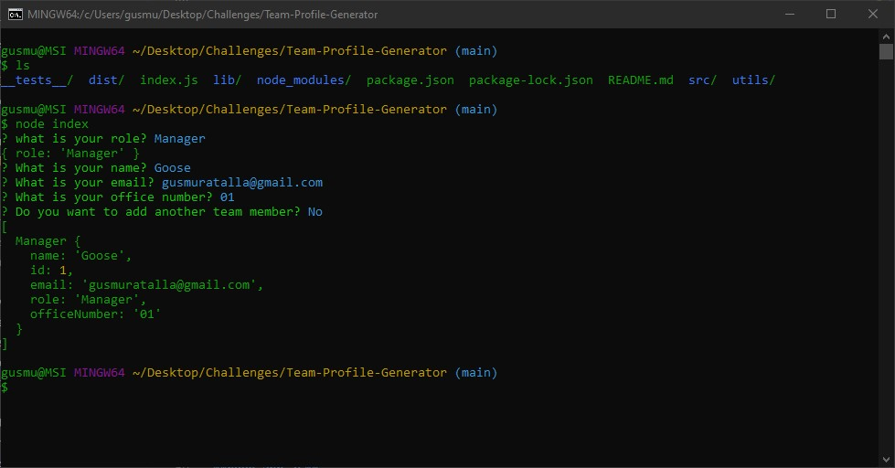
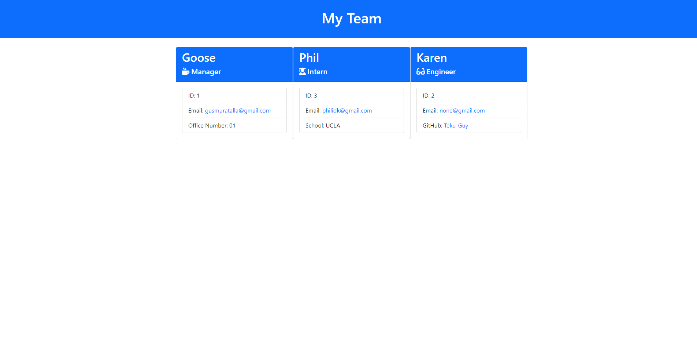
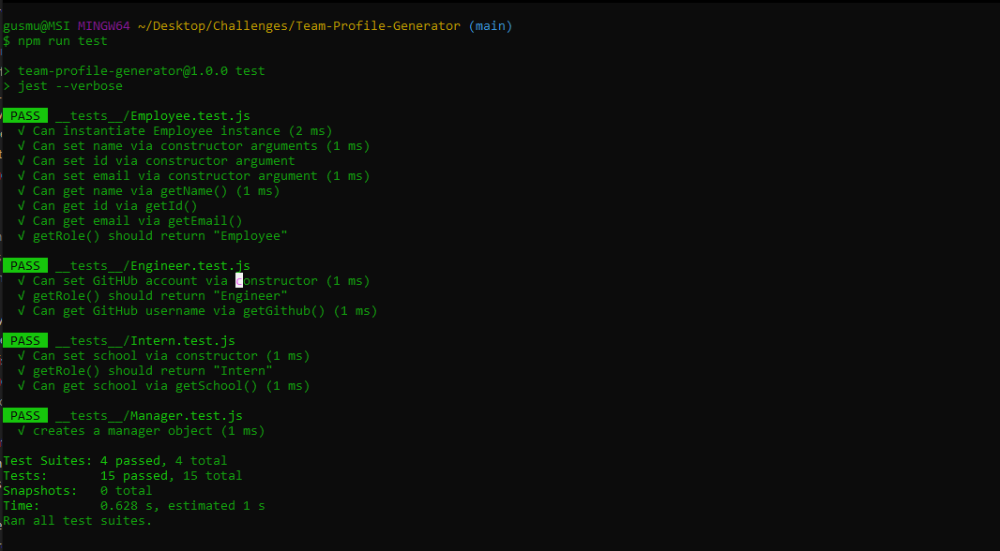

# Team Profile Generator

[](https://opensource.org/licenses/MIT)

## Description

```

This Node CLI application takes in information about
employees and generates an HTML webpage that displays
summaries for each person.

```

## Table of Contents

* [User Story](##User-Story)

* [Acceptance Criteria](##Usage)

* [Mock-Up](##Mock-Up)

* [Installaion](##Installation)

* [Resources](##Resources)

* [Contact Developer](##Contact-Developer)


## User Story

```
AS A manager
I WANT to generate a webpage that displays my team's basic info
SO THAT I have quick access to their emails and GitHub profiles

```

## Acceptance Criteria

```
GIVEN a command-line application that accepts user input
WHEN I am prompted for my team members and their information
THEN an HTML file is generated that displays a nicely formatted team roster based on user input
WHEN I click on an email address in the HTML
THEN my default email program opens and populates the TO field of the email with the address
WHEN I click on the GitHub username
THEN that GitHub profile opens in a new tab
WHEN I start the application
THEN I am prompted to enter the team manager’s name, employee ID, email address, and office number
WHEN I enter the team manager’s name, employee ID, email address, and office number
THEN I am presented with a menu with the option to add an engineer or an intern or to finish building my team
WHEN I select the engineer option
THEN I am prompted to enter the engineer’s name, ID, email, and GitHub username, and I am taken back to the menu
WHEN I select the intern option
THEN I am prompted to enter the intern’s name, ID, email, and school, and I am taken back to the menu
WHEN I decide to finish building my team
THEN I exit the application, and the HTML is generated

```
## Mock-Up

<br>


## Installation

To install Team Profile Generator dependencies run the following command: 

**npm i**

To use Team Profile Generator run the following command in the terminal:

**node app.js**

To test Team Profile Generator run the following command in the terminal:

**npm run test**



## Resources

[npm inquirer](https://www.npmjs.com/package/inquirer)

[badge source](https://gist.github.com/lukas-h/2a5d00690736b4c3a7ba#apache-20-license)

[License Source](https://choosealicense.com/licenses/mit/)

[Class Constructor](https://developer.mozilla.org/en-US/docs/Web/JavaScript/Reference/Classes/constructor)

[Object Prototypes](https://developer.mozilla.org/en-US/docs/Learn/JavaScript/Objects/Object_prototypes)

## Contact Developer

Team Profile Generator was developed by Gustavo Muratalla

Email Address: gusmuratalla@gmail.com

[Gustavo's Github Profile](https://github.com/Teku-Guy)

*Copyright (c) 2020 Gustavo Muratalla*

